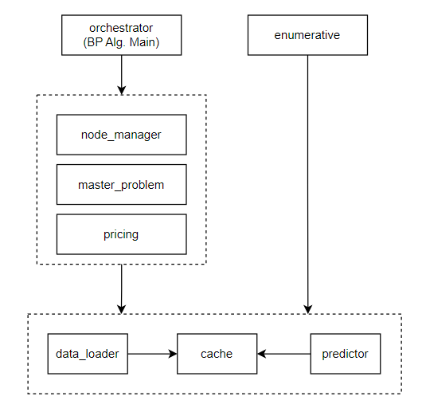

# O2O Heterogeneous Driver Optimization System

## Overview

This project implements a sophisticated **Branch-and-Price** algorithm for solving O2O (Online-to-Offline) delivery optimization problems with heterogeneous drivers. The system combines machine learning prediction models with exact optimization algorithms to generate high-quality delivery plans that consider heterogeneity factors.

### Key Features

- **Dual Algorithm Framework**: Supports both Enumerative and Branch-and-Price solution approaches
- **ML-Enhanced Prediction**: Integrates XGBoost models for intelligent cost prediction
- **Heterogeneous Driver Modeling**: Incorporates multi-dimensional features
- **High-Performance Parallel Computing**: Multi-process architecture for concurrent prediction, pricing, and caching services
- **Intelligent Heuristics**: Dynamic RMIP heuristic triggering based on gap monitoring to accelerate convergence

## System Architecture

### Architecture Flowchart



### Architecture Overview

The project is organized into a modular structure separating algorithms, solvers, services, and data management.

```
src/
├── experiment_main.py         # Batch Experiment Entry Point
│
├── algorithms/                # Core Algorithm Logic
│   ├── orchestrator.py        # B&P Controller (Main Loop)
│   ├── enumerative.py         # Baseline Enumeration Algorithm
│   └── node_manager.py        # Branch Tree Management
│
├── solvers/                   # Optimization Solvers (Proxies)
│   ├── master_problem.py      # [Interface] RMP Solver (Gurobi)
│   └── pricing.py             # [Interface] Pricing Subproblem (Label Setting)
│
├── services/                  # Support Services (Multi-processing)
│   ├── predictor.py           # [Interface] ML Prediction Service
│   ├── cache.py               # Caching Service
│   └── logger.py              # Distributed Logging Service
│
├── data/                      # Data Handling
│   ├── loader.py              # [Interface] Data Loading & Preprocessing
│   ├── structures.py          # [Interface] Data Classes (Orders, Drivers)
│   └── requests.py            # IPC Message Definitions
│
└── utils/                     # Utilities
    └── common.py              # Helper Functions
```

### Core Modules

#### 1. **Algorithms (`src/algorithms/`)**

- **`orchestrator.py`**: Core controller for Branch-and-Price algorithm
  - Column Generation main loop
  - Arc-based branching strategy
  - Heuristic triggering and termination management
  
- **`enumerative.py`**: Baseline enumeration algorithm
  - Exhaustive enumeration of route combinations
  - Integer programming for optimal assignment

- **`node_manager.py`**: Branch tree management
  - Node selection strategy
  - Global upper and lower bound maintenance
  - Optimal solution tracking

#### 2. **Solvers (`src/solvers/`)**

- **`master_problem.py`**: Restricted Master Problem (RMP) solver
  - Linear relaxation and integer programming with Gurobi
  - Dynamic column management (add/filter columns)
  - Dual price extraction

- **`pricing.py`**: Pricing subproblem solver
  - Label-setting algorithm implementation
  - Resource-Constrained Shortest Path Problem (RCSPP)
  - Dominance rules and pruning strategies

#### 3. **Services (`src/services/`)**

- **`predictor.py`**: Machine learning prediction service
  - Multi-process worker pool management
  - Batch prediction for route delays/costs

- **`cache.py`**: Intelligent caching service
  - Multi-level caching strategy (sequence cache + arc cost cache)
  - Reduces redundant prediction calls
  - Concurrent access control by driver index

- **`logger.py`**: Distributed logging service
  - Multi-process safe logging
  - Hierarchical log output (INFO/DEBUG/ERROR)

#### 4. **Data (`src/data/`)**

- **`loader.py`**: Data loading and preprocessing
  - Order data loading
  - Driver data loading
  
- **`structures.py`**: Core data structure definitions
  - `Orders`: Batch order data container
  - `Drivers`: Batch driver data container
  - `Node`: B&P branch tree node

- **`requests.py`**: Request/Response Class Definitions
  - `CacheRequest`
  - `PredictRequest/Response`
  - `PricingRequest/Response`

#### 5. **Utils (`src/utils/`)**

- **`common.py`**: Utility Functions
  - Distance calculation
  - Date matching
  - Data conversion

## Tech Stack

- **Optimization Solver**: Gurobi Optimizer 11.0+
- **Machine Learning**: XGBoost 1.7+
- **Parallel Computing**: Python `multiprocessing`
- **Numerical Computing**: NumPy 1.24+
- **Data Processing**: Pandas 2.0+

## Quick Start

### Installation

```bash
pip install -r requirements.txt
```

### Run Batch Experiments

Run the experiment runner from the project root:

```bash
python -m src.experiment_main
```

### Run Single Scenario (via Orchestrator)

You can also run the orchestrator directly as a module:

```bash
python -m src.algorithms.orchestrator
```

## Algorithm Details

### Branch-and-Price Workflow

1. **Initialization Phase**
   - Load order and driver data
   - Generate initial columns using greedy heuristics
   - Build root node Restricted Master Problem (RMP)

2. **Column Generation Phase** (for each node)
   - Solve current RMP, obtain dual prices
   - Solve pricing subproblems for all drivers in parallel (using label-setting algorithm)
   - Add columns with negative reduced cost to RMP
   - Repeat until convergence

3. **Branching Phase**
   - Check integrality of RMP solution
   - If fractional, select arc variable for branching
   - Create child nodes (arc=0 and arc=1)

4. **Heuristic Acceleration**
   - Monitor gap and stagnation status
   - Solve RMIP to obtain integer upper bound when conditions are met
   - Early termination when gap meets termination criterion

5. **Termination Conditions**
   - Branch tree is empty
   - Gap ≤ termination threshold
   - Maximum runtime exceeded

### Pricing Subproblem

Solves Resource-Constrained Shortest Path Problem using dynamic programming label-setting algorithm:

- **State**: (current node, visited set, departure time, reduced cost, path)
- **Transition**: Extend to unvisited order nodes
- **Dominance Rule**: For same (node, visited set), labels with earlier time and lower cost dominate others
- **Pruning**: Remove orders exceeding due time from unvisited set

## Results Output

### Console Output

During algorithm execution, outputs include:
- Timing statistics for each phase
- Node solving status
- Gap evolution trends
- Performance summary

### File Output

- `logs/debug.log`: Detailed debug logs
- `logs/branch_tree.json`: Branch tree structure (for visualization)
- `results/new_experiment/experiment_summary.csv`: Batch experiment results summary
- `results/new_experiment/<scenario_name>/`: Detailed solutions for each scenario

## Performance Optimization

1. **Parallelism Tuning**
   - `predictor_workers`: Recommended 50-70% of CPU cores
   - `pricing_workers`: Recommended 30-50% of order count

2. **k_best Parameter**
   - Small-scale problems (≤30 orders): k_best = driver_number
   - Large-scale problems (>30 orders): k_best = driver_number * 1.5

3. **Heuristic Triggering**
   - Early triggering (N_warmup=5, N_stagnant=3): Faster convergence, potentially lower quality
   - Delayed triggering (N_warmup=20, N_stagnant=10): Higher quality, longer runtime

## Citation

If you use this project in your research, please cite:

```bibtex
@software{o2o_driver_optimization,
  title = {O2O Heterogeneous Driver Optimization System},
  year = {2025},
  url = {https://github.com/Shrouu/O2O_Routing}
}
```

## License

This project is licensed under the MIT License.

## Contact

- Repository: https://github.com/Shrouu/O2O_Routing
- Issues: Please use GitHub Issues for bug reports and feature requests